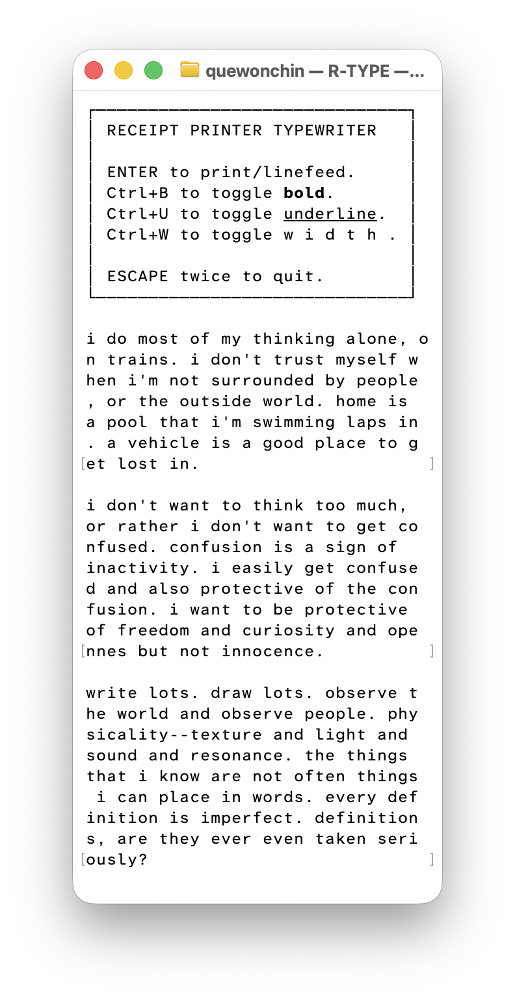

# R-TYPE

This is a "typewriter" meant to be used on MacOS with a mini receipt printer (using 58mm thermal paper) connected via USB.

Running `receipt-typewriter` will launch a terminal program that allows you to type and format text. Lines will immediately be sent to the printer.

I like the experience of writing on this program, and I might emulate it for the web. Being able to edit the current 32-character line you're on and only that means that you're forced to confront and accept everything you've written previously, your thoughts as ephemeral as thermal receipt paper.

This is what the R-TYPE looks like in action:

# Running the program

`receipt-typewriter` requires python and pip to run. These are aliased as `python3` and `pip3`, but it should be easy to modify the script if you have any other alias.

While I specified MacOS as the target platform, there isn't necessarily anything OS-specific about the code, and it's possible it'll also run on Linux without any issues. I haven't tested it on any other device, though.